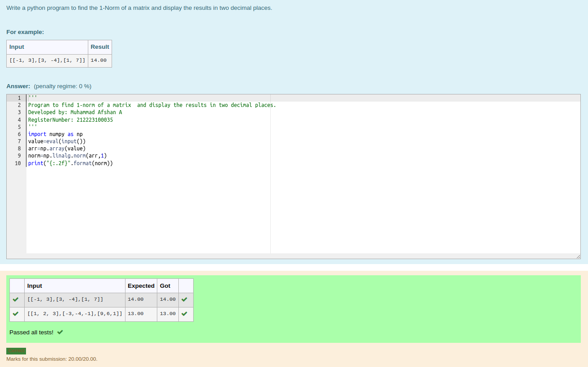
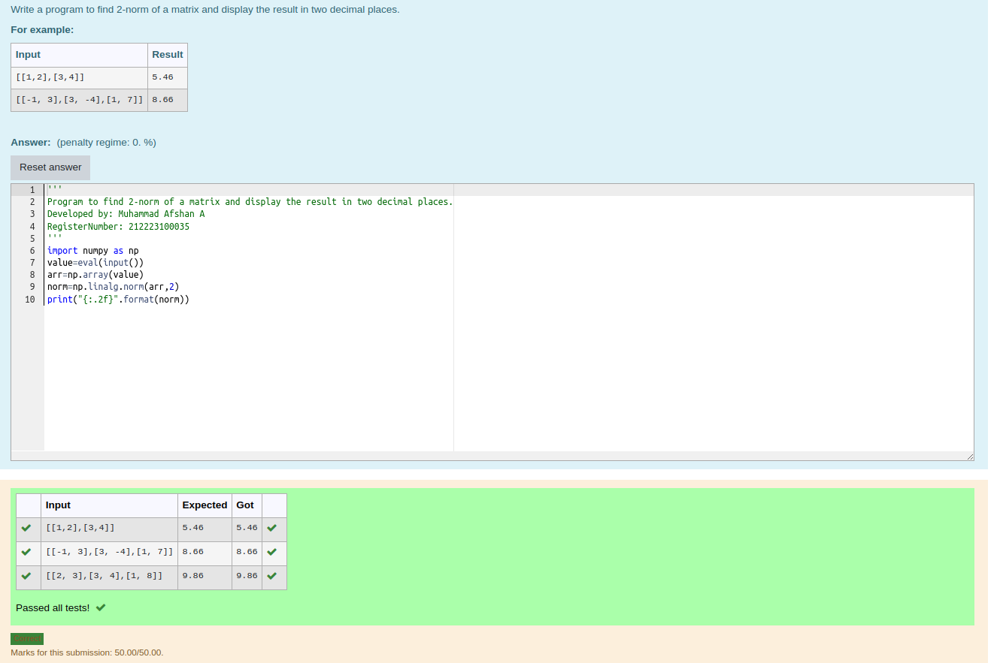
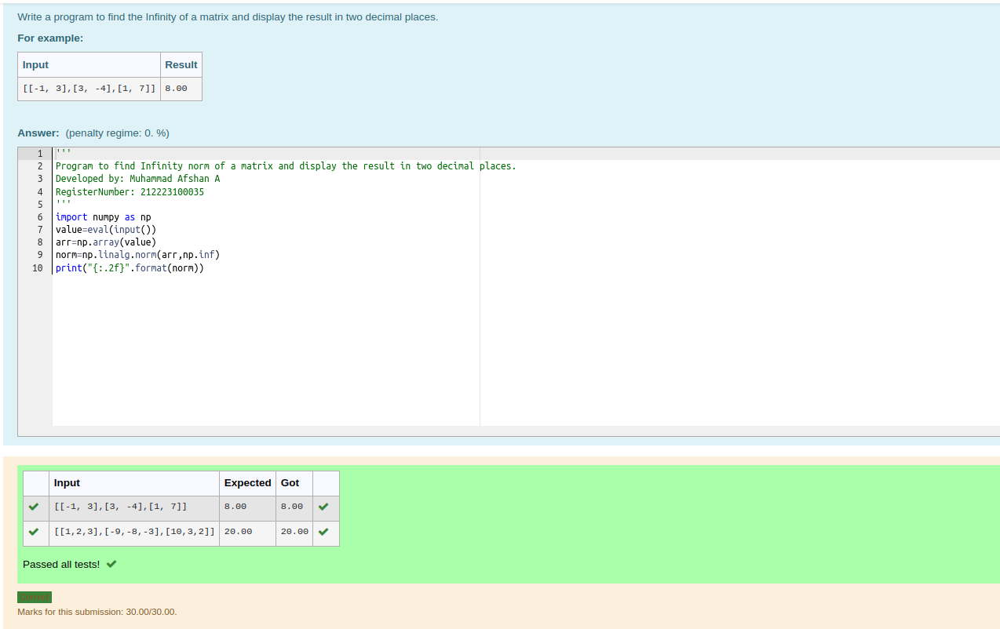

# Norm of a matrix
## Aim
To write a program to find the 1-norm, 2-norm and infinity norm of the matrix and display the result in two decimal places.
## Equipment’s required:
1.	Hardware – PCs
2.	Anaconda – Python 3.7 Installation / Moodle-Code Runner
## Algorithm:
	1. Get the input matrix using np.array()   
    2. Find the 2-norm of the matrix using np.linalg.norm()
	3. Print the norm of the matrix in two decimal places.
## Program:
<br>


### 1-Norm of a Matrix
```
'''
Program to find 1-norm of a matrix  and display the
results in two decimal places.
Developed by: Muhammad Afshan A
RegisterNumber: 212223100035
'''
import numpy as np
value=eval(input())
arr=np.array(value)
norm=np.linalg.norm(arr,1)
print("{:.2f}".format(norm))


```
<br>
<br>

### 2-Norm of a Matrix
```
'''
Program to find 2-norm of a matrix and display the result
in two decimal places.
Developed by: Muhammad Afshan A
RegisterNumber: 212223100035
'''
import numpy as np
value=eval(input())
arr=np.array(value)
norm=np.linalg.norm(arr,2)
print("{:.2f}".format(norm))


```
<br>
<br>

### Infinity Norm of a Matrix
```
'''
Program to find Infinity norm of a matrix and display the
result in two decimal places.
Developed by: Muhammad Afshan A
RegisterNumber: 212223100035
'''
import numpy as np
value=eval(input())
arr=np.array(value)
norm=np.linalg.norm(arr,np.inf)
print("{:.2f}".format(norm))


```
<br>
<br>

## Output:
### 1-Norm of a Matrix


<br>


### 2-Norm of a Matrix


<br>


### Infinity Norm of a Matrix


<br>

## Result
Thus the program for 1-norm, 2-norm and Infinity norm of a matrix are written and verified.
